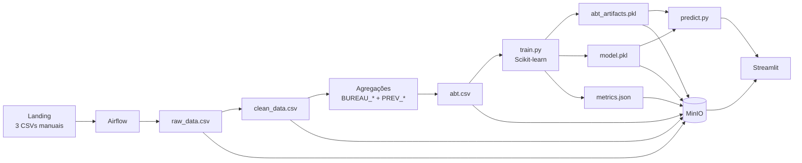

# Arquitetura funcional — Home Credit Risk V_3

## Visão completa



## Fluxo de dados

```text
Landing
  ↓
data_ingestion.py
  ↓
raw_data.csv
  ↓
data_sanitization.py
  ↓
clean_data.csv
  ↓
feature_aggregation.py
  ↓
BUREAU_* + PREV_*
  ↓
abt_transform.py
  ↓
abt.csv
```

## Fluxo de ML

```text
abt.csv
  ↓
train.py
  ↓
preprocessing + seleção + tuning
  ↓
fit final
  ├── abt_artifacts.pkl (preprocessor + schema)
  ├── model.pkl (estimador + threshold)
  └── metrics.json
  ↓
predict.py carrega abt_artifacts.pkl + model.pkl
  ↓
Streamlit
```

## Fluxo do Streamlit

### Cliente histórico

```text
MinIO
  ↓
Dados/abt.csv
  ↓
Streamlit seleciona um cliente
  ↓
Model/predict.py
  ↓
abt_artifacts.pkl
  ↓
model.pkl
  ↓
PD + decisão
```

### Nova solicitação

```text
Formulário Streamlit
  ↓
Model/predict.py
  ↓
criação das features derivadas
  ↓
abt_artifacts.pkl
  ↓
model.pkl
  ↓
PD + decisão
```

## Containers

```text
Docker Compose
│
├── MinIO
│   └── dados, artefatos do modelo, métricas e relatórios
│
├── Airflow
│   └── DAG do pipeline + execução dos scripts
│
└── Streamlit
    └── serviço demonstrativo de predição
```

## Responsabilidades dos arquivos

| Arquivo | Responsabilidade |
|---|---|
| `DataPipeline/data_ingestion.py` | promove os três CSVs da Landing |
| `DataPipeline/data_sanitization.py` | limpeza e padronização |
| `DataPipeline/feature_aggregation.py` | agrega históricos por `SK_ID_CURR` |
| `DataPipeline/abt_transform.py` | cria ABT e feature engineering |
| `DataPipeline/pipeline_functions.py` | centraliza funções reutilizáveis usadas pelo pipeline e notebooks |
| `Model/train.py` | preprocessing, CV, tuning, treino e avaliação |
| `Model/predict.py` | inferência reutilizável usando os dois PKLs |
| `MLOps/storage.py` | abstração local/MinIO |
| `MLOps/pipeline_orchestration.py` | sequência de execução |
| `app/app.py` | interface Streamlit |
