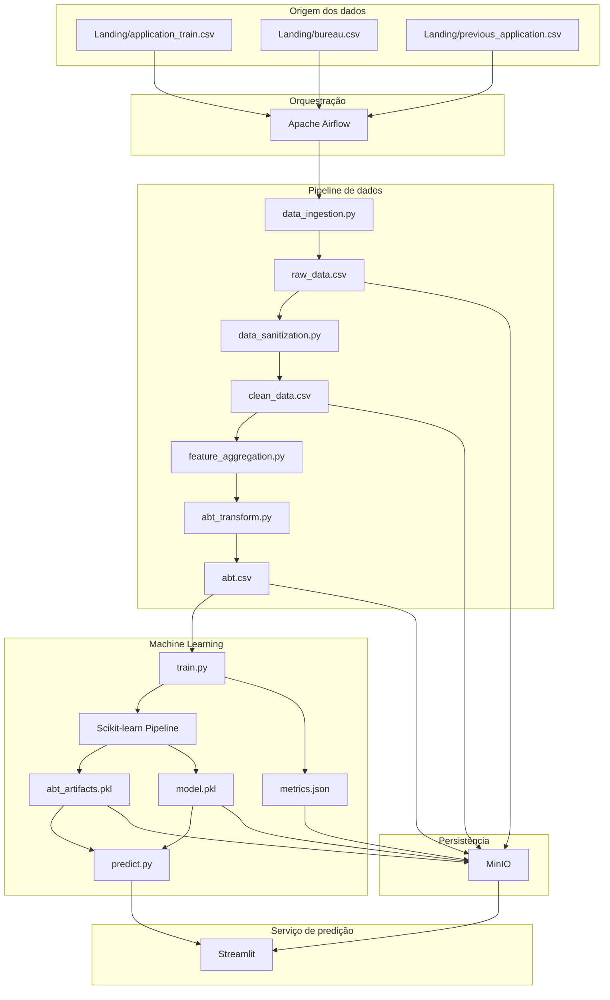

# MLOps — Home Credit Risk V_3

Este diretório concentra os itens da etapa individual implementados no repositório: **arquitetura da solução, infraestrutura Docker Compose, orquestração, serviço de predição e proposta de automação/agentes de IA**.

---

## 1. Arquitetura funcional completa



### Componentes

| Componente | Papel |
|---|---|
| Landing | ponto de entrada manual dos três CSVs |
| Airflow | executa e registra as etapas do pipeline |
| DataPipeline | ingestão, limpeza, agregação e ABT |
| Scikit-learn | preprocessing, seleção, tuning, treino e inferência |
| MinIO | data lake/object storage compatível com S3 |
| Streamlit | serviço demonstrativo de predição e leitura de resultados |
| `abt_artifacts.pkl` | contrato da ABT + preprocessing ajustado |
| `model.pkl` | estimador vencedor + threshold |

---

## 2. Infraestrutura Docker Compose

A solução é iniciada integralmente com um único comando, executado na raiz do projeto:

```powershell
docker compose -f .\MLOps\docker-compose.yml up -d --build
```

Serviços:

```text
MinIO     http://localhost:9001
Airflow   http://localhost:8080
Streamlit http://localhost:8501
```

Credenciais locais:

```text
MinIO:   minioadmin / minioadmin123
Airflow: airflow / airflow
```

Para derrubar tudo:

```powershell
docker compose -f .\MLOps\docker-compose.yml down -v --remove-orphans
```

O host não precisa de `.venv`, Python ou `pip install` para executar a solução.

---

## 3. Orquestração

A DAG:

```text
home_credit_risk_v3_pipeline
```

executa:

```text
00_check_inputs
      ↓
01_ingest_raw_data
      ↓
02_clean_data
      ↓
03_feature_aggregation
      ↓
04_build_abt
      ↓
05_train_model
      ↓
06_score_sample
```

A DAG usa `schedule=None`; a demonstração é acionada manualmente.

O arquivo:

```text
MLOps/pipeline_orchestration.py
```

contém as mesmas funções do fluxo e permite executar o pipeline sem depender da interface do Airflow.

---

## 4. Serviço de predição

A camada de serving é o **Streamlit**, sem FastAPI.

```text
app/app.py
   ↓
Model/predict.py
   ├── DataPipeline/abt_artifacts.pkl
   └── Model/model.pkl
```

`predict.py` carrega os dois artefatos de produção. O `abt_artifacts.pkl` alinha o schema e aplica o preprocessing ajustado; depois o `model.pkl` recebe a matriz transformada e calcula a probabilidade. Antes disso, `predict.py` recria as três razões financeiras com a mesma função usada na ABT e retorna:

```text
PD_DEFAULT
THRESHOLD
CREDIT_DECISION
ACTION_SUGGESTION
```

O Streamlit é somente a interface. A regra de inferência permanece centralizada em `Model/predict.py`.

### Origem dos dados utilizados pelo Streamlit

**Cliente histórico:**

```text
MinIO -> Dados/abt.csv -> Streamlit -> predict.py -> abt_artifacts.pkl -> model.pkl
```

**Nova solicitação:**

```text
Formulário do Streamlit -> predict.py -> abt_artifacts.pkl -> model.pkl
```

As métricas exibidas pela interface são lidas de `Model/metrics.json` e de relatórios em `reports/`. O Streamlit não lê diretamente os arquivos da `Landing/`.

---

## 5. Ações automatizadas a partir das previsões

As previsões podem acionar fluxos distintos sem alterar a probabilidade produzida pelo modelo.

| Condição | Automação proposta |
|---|---|
| PD muito baixa + dados válidos | encaminhar para fluxo de aprovação conforme política vigente |
| PD intermediária/próxima ao threshold | abrir fila de revisão manual |
| PD acima do threshold | impedir aprovação automática e enviar para análise de risco |
| documentação/dado crítico ausente | solicitar complemento antes da decisão |

Essas ações são uma proposta de integração com processos da empresa; o protótipo atual demonstra a PD e a política no Streamlit.

---

## 6. Agentes de IA — proposta de evolução

Um agente de IA pode ser conectado ao fluxo **como assistente operacional**, não como aprovador autônomo.

Casos de uso adequados:

1. **Resumo de caso de crédito**
   - recebe PD, variáveis principais e explicabilidade;
   - gera um resumo textual para o analista.

2. **Assistente de revisão manual**
   - monta checklist com documentos e pontos a validar;
   - destaca inconsistências de dados.

3. **Assistente de explicabilidade**
   - transforma feature importance/SHAP em linguagem simples;
   - apresenta os principais fatores de risco e proteção do caso.

A promoção de uma decisão continua sujeita à política de crédito e validação humana.

---

## 7. Governança e rastreabilidade

Artefatos que sustentam a rastreabilidade da execução:

```text
DataPipeline/abt_artifacts.pkl
Model/model.pkl
Model/metrics.json
reports/model_comparison.csv
reports/grid_search_results.csv
reports/holdout_predictions.csv
reports/threshold_analysis.csv
reports/roc_curve_best_model.csv
reports/feature_importance.csv
reports/permutation_importance.csv
reports/shap_importance.csv
```

Para uma evolução real de produção, podem ser acrescentados:

- versionamento formal de modelos e dados;
- histórico das decisões de crédito;
- autenticação e controle de acesso aos serviços;
- auditoria das alterações de política/threshold;
- aprovação humana para promoção de novas versões do modelo.

---

## 8. Próximos passos

1. integrar a saída do score a uma fila de aprovação/revisão;
2. associar explicabilidade diretamente ao caso analisado;
3. usar agente de IA para resumo e checklist de revisão;
4. registrar versão do modelo utilizada em cada decisão;
5. integrar autenticação e perfis de acesso no Streamlit;
6. manter validação humana antes de mudanças na política ou promoção de novo modelo.
