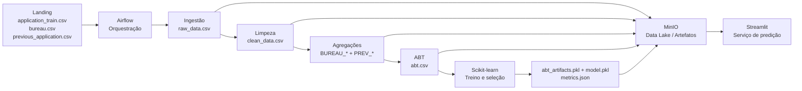

# FIA Projeto Final — Home Credit Risk V_3

Projeto de Machine Learning para estimar a probabilidade de inadimplência de uma solicitação de crédito usando o conjunto **Home Credit Default Risk**.

A V_3 foi organizada para que os itens técnicos da entrega final possam ser localizados diretamente no repositório: pipeline de dados, ABT, treinamento, avaliação, arquitetura, Docker Compose, orquestração, serviço de predição e proposta de automações/agentes de IA.

A implementação usa exatamente três arquivos de entrada:

- `application_train.csv`
- `bureau.csv`
- `previous_application.csv`

Os arquivos são adicionados manualmente na pasta `Landing/`. O projeto **não utiliza FastAPI**; o serviço demonstrativo de predição é entregue via **Streamlit**.

---

## 1. Problema e objetivo de negócio

O objetivo é apoiar a política de concessão de crédito estimando a **probabilidade de inadimplência (PD - Probability of Default)** de cada solicitação.

A saída do modelo contém:

- `PD_DEFAULT`: probabilidade estimada de inadimplência;
- `THRESHOLD`: limite usado pela política de decisão;
- `CREDIT_DECISION`: `APROVAR` ou `NEGAR / REVISAR`;
- `ACTION_SUGGESTION`: sugestão operacional associada ao risco.

Na base de treinamento:

```text
TARGET = 0 -> cliente adimplente
TARGET = 1 -> cliente inadimplente
```

O modelo não substitui regras de governança ou análise humana. O threshold é tratado como uma **regra de política de crédito separada da probabilidade produzida pelo modelo**.

---

## 2. Arquitetura funcional



A arquitetura detalhada está em:

```text
Docs/architecture.md
MLOps/README.md
```

---

## 3. Estrutura do repositório

```text
FIA-Projeto-Final-V_3/
│
├── Landing/
│   ├── application_train.csv              # adicionado manualmente
│   ├── bureau.csv                         # adicionado manualmente
│   └── previous_application.csv           # adicionado manualmente
│
├── Dados/
│   ├── raw_data.csv                       # gerado pelo pipeline
│   ├── clean_data.csv                     # gerado pelo pipeline
│   ├── abt.csv                            # gerado pelo pipeline
│   └── _processing/
│       ├── raw_bureau.csv
│       ├── raw_previous_application.csv
│       ├── clean_bureau.csv
│       ├── clean_previous_application.csv
│       ├── features_bureau.csv
│       └── features_previous_application.csv
│
├── DataPipeline/
│   ├── config.py                          # variáveis, parâmetros e metadados
│   ├── pipeline_functions.py              # funções reutilizáveis do pipeline/notebooks
│   ├── abt_artifacts.pkl                  # preprocessing + schema; gerado no treino
│   ├── data_ingestion.py                  # Landing -> raw
│   ├── data_sanitization.py               # limpeza e padronização
│   ├── feature_aggregation.py             # bureau/previous -> 1 linha por cliente
│   ├── abt_transform.py                   # construção da ABT
│   ├── exp_analysis.ipynb                 # análise exploratória
│   └── abt_overview.ipynb                 # validação da ABT
│
├── Model/
│   ├── config.py                          # parâmetros da modelagem
│   ├── train.py                           # treinamento e avaliação
│   ├── predict.py                         # serviço de inferência reutilizável
│   ├── evaluation.ipynb                   # avaliação e interpretabilidade
│   ├── model.pkl                          # gerado no treino
│   └── metrics.json                       # gerado no treino
│
├── MLOps/
│   ├── README.md                          # arquitetura, orquestração e próximos passos
│   ├── docker-compose.yml                 # infraestrutura local
│   ├── pipeline_orchestration.py          # orquestração reutilizável
│   ├── storage.py                         # filesystem/MinIO
│   ├── Dockerfile.airflow
│   ├── Dockerfile.app
│   ├── requirements-airflow.txt
│   ├── requirements-app.txt
│   └── dags/home_credit_risk_v3_dag.py
│
├── app/
│   └── app.py                             # Streamlit
│
├── Docs/
│   ├── architecture.md
│   ├── checklist_avaliacao.md
│   └── roteiro_banca.md
│
├── reports/                               # métricas e relatórios gerados
├── Tools/
├── requirements.txt                      # manifesto acadêmico de dependências
└── README.md
```

`requirements.txt` existe para atender à estrutura documental da entrega. A execução oficial continua sendo feita **somente via Docker**, sem `.venv` e sem `pip install` no host.

---

## 4. Fluxo de dados

```text
Landing
  │
  ├── application_train.csv
  ├── bureau.csv
  └── previous_application.csv
  │
  ▼
01_ingest_raw_data
  │
  ├── Dados/raw_data.csv
  └── Dados/_processing/raw_*.csv
  │
  ▼
02_clean_data
  │
  ├── Dados/clean_data.csv
  ├── clean_bureau.csv
  └── clean_previous_application.csv
  │
  ▼
03_feature_aggregation
  │
  ├── BUREAU_*  (até 15 features)
  └── PREV_*    (até 13 features)
  │
  ▼
04_build_abt
  │
  ├── joins por SK_ID_CURR
  ├── 3 razões financeiras
  ├── histórico ausente preenchido com 0
  └── remoção de colunas com >50% de nulos
  │
  ▼
Dados/abt.csv
  │
  ▼
05_train_model
  │
  ├── split 80/20 estratificado
  ├── amostra de 20% do treino para seleção/tuning
  ├── 3-fold StratifiedKFold
  ├── Logistic Regression
  ├── Random Forest
  ├── Gradient Boosting
  ├── GridSearchCV no vencedor
  └── avaliação única no holdout
  │
  ▼
DataPipeline/abt_artifacts.pkl + Model/model.pkl + Model/metrics.json + reports/
  │
  ▼
06_score_sample
  │
  ▼
Streamlit
```

---

## 5. Papel das fontes

### `application_train.csv`

Base principal, uma linha por solicitação atual. Contém cadastro, renda, valor do crédito, anuidade, características da solicitação, `EXT_SOURCE_*` e `TARGET`.

### `bureau.csv`

Histórico de créditos registrados em outras instituições. Como um cliente pode ter vários créditos, a tabela é agregada por `SK_ID_CURR` antes do join.

São geradas até 15 features `BUREAU_*`, incluindo contagem de créditos, créditos ativos/encerrados, dívida, atraso, valores de crédito e razão dívida/crédito.

### `previous_application.csv`

Solicitações anteriores do mesmo cliente. Também é agregada por `SK_ID_CURR`.

São geradas até 13 features `PREV_*`, incluindo quantidade de solicitações, aprovações, recusas, taxas de aprovação/recusa, valores e prazo médio.

---

## 6. Tratamento de dados e construção da ABT

### Limpeza

`DataPipeline/data_sanitization.py`:

- padroniza nomes das colunas;
- remove duplicidades;
- trata o valor anômalo `DAYS_EMPLOYED = 365243`;
- trata regras específicas das fontes auxiliares;
- mantém a granularidade original antes da agregação.

### Agregação

`DataPipeline/feature_aggregation.py` transforma `bureau` e `previous_application` para **uma linha por `SK_ID_CURR`**, evitando multiplicação de registros no join.

### Feature engineering

`DataPipeline/abt_transform.py` cria:

```text
CREDIT_INCOME_RATIO  = AMT_CREDIT / AMT_INCOME_TOTAL
ANNUITY_INCOME_RATIO = AMT_ANNUITY / AMT_INCOME_TOTAL
ANNUITY_CREDIT_RATIO = AMT_ANNUITY / AMT_CREDIT
```

Além disso:

- incorpora `BUREAU_*` e `PREV_*`;
- preenche histórico inexistente com zero;
- remove colunas com mais de 50% de nulos;
- preserva `EXT_SOURCE_1`, `EXT_SOURCE_2` e `EXT_SOURCE_3`.

### Centralização e reutilização de código

As regras reutilizáveis do pipeline ficam concentradas em:

```text
DataPipeline/pipeline_functions.py
```

Esse módulo centraliza, entre outras responsabilidades:

- padronização de nomes de colunas;
- limpeza de `application_train`, `bureau` e `previous_application`;
- agregações `BUREAU_*` e `PREV_*`;
- criação das três razões financeiras;
- joins e regras de construção da ABT;
- validações de qualidade e helpers usados nos notebooks;
- leitura padronizada dos artefatos e relatórios;
- funções de visualização utilizadas nas análises.

Os scripts `data_sanitization.py`, `feature_aggregation.py` e `abt_transform.py` ficam responsáveis principalmente pela **orquestração de I/O da etapa**: ler o dado, chamar a função reutilizável, persistir a saída e registrar o relatório.

A mesma função `add_financial_ratios()` é utilizada tanto na construção da ABT quanto em `Model/predict.py`. Assim, treino e inferência utilizam exatamente a mesma regra de feature engineering.

Parâmetros, nomes de colunas, listas de features e caminhos lógicos compartilhados ficam em `DataPipeline/config.py`, reduzindo valores chumbados nos scripts e notebooks.

---

## 7. Fundamentação do modelo

O projeto compara três famílias de algoritmos para um problema de classificação binária.

### Logistic Regression

É usada como baseline linear e interpretável. Modela a relação entre as features e a probabilidade da classe positiva através da função logística.

### Random Forest

Combina múltiplas árvores construídas sobre amostras e subconjuntos de variáveis. É capaz de capturar relações não lineares e interações sem exigir escalonamento das features.

### Gradient Boosting

Constrói árvores sequencialmente, fazendo cada nova árvore corrigir erros residuais das anteriores. É adequado para relações não lineares e costuma apresentar bom desempenho em dados tabulares.

### Desbalanceamento

A classe de inadimplentes é minoritária. Para reduzir o efeito desse desbalanceamento:

- Logistic Regression: `class_weight="balanced"`;
- Random Forest: `class_weight="balanced"`;
- Gradient Boosting: `sample_weight` calculado com `compute_sample_weight`.

---

## 8. Mecanismos técnicos do treinamento

Durante CV, tuning e treino, o preprocessing fica dentro do `Pipeline` do Scikit-learn, evitando que imputação ou encoding sejam aprendidos a partir do holdout. Após o fit final, o preprocessor ajustado é persistido em `DataPipeline/abt_artifacts.pkl`, enquanto o estimador vencedor é persistido em `Model/model.pkl`.

### Numéricas

- `SimpleImputer(strategy="median")`;
- `StandardScaler` apenas na Logistic Regression.

### Categóricas

- `SimpleImputer(strategy="most_frequent")`;
- `OrdinalEncoder(handle_unknown="use_encoded_value", unknown_value=-1)`.

### Seleção e controle de overfitting

```text
ABT
 ↓
80% treino / 20% holdout
 ↓
20% do conjunto de treino para seleção/tuning
 ↓
3-fold StratifiedKFold
 ↓
CV-AUC dos três candidatos
 ↓
modelo vencedor
 ↓
GridSearchCV
 ↓
fit final nos 80% completos
 ↓
avaliação única nos 20% de holdout
```

O holdout não participa da seleção do algoritmo nem da busca de hiperparâmetros.

---

## 9. Métricas e explicabilidade

O treinamento gera:

- AUC-ROC;
- KS;
- Average Precision;
- Recall da classe inadimplente;
- Precision da classe inadimplente;
- F1;
- Accuracy;
- Matriz de confusão;
- análise de thresholds 0.30, 0.50 e 0.70;
- importância nativa;
- permutation importance;
- SHAP global quando disponível.

Principais artefatos:

```text
Model/metrics.json
reports/model_comparison.csv
reports/grid_search_results.csv
reports/holdout_predictions.csv
reports/threshold_analysis.csv
reports/roc_curve_best_model.csv
reports/feature_importance.csv
reports/permutation_importance.csv
reports/shap_importance.csv
```

O notebook `Model/evaluation.ipynb` usa esses artefatos para análise do modelo e interpretabilidade.

---

## 10. Notebooks

### `DataPipeline/exp_analysis.ipynb`

Analisa `clean_data.csv` antes da construção da ABT:

- `TARGET`;
- nulos;
- renda, crédito e anuidade;
- idade;
- `EXT_SOURCE_*`;
- variáveis categóricas;
- relações financeiras;
- cobertura das fontes auxiliares.

Cada célula de código possui um bloco Markdown imediatamente anterior explicando o que o bloco faz.

### `DataPipeline/abt_overview.ipynb`

Valida:

- granularidade;
- IDs;
- duplicidades;
- blocos Application/Bureau/Previous;
- cobertura dos históricos;
- relações com `TARGET`;
- razões financeiras.

### `Model/evaluation.ipynb`

Analisa:

- comparação dos modelos;
- modelo vencedor;
- holdout;
- ROC;
- matriz de confusão;
- thresholds;
- importâncias;
- SHAP.

Os notebooks permanecem como material analítico. **Jupyter não faz parte da infraestrutura Docker**. A lógica reutilizável fica em `DataPipeline/pipeline_functions.py`; os notebooks ficam focados em chamadas de funções, exibição dos resultados e interpretação de cada bloco.

---

## 11. Infraestrutura com Docker Compose

A execução local oficial não exige Python local, `.venv` ou instalação manual de bibliotecas.

Pré-requisito:

```text
Docker Desktop / Docker Compose
```

### 11.1 Adicionar os dados

Copie manualmente para `Landing/`:

```text
application_train.csv
bureau.csv
previous_application.csv
```

### 11.2 Subir a infraestrutura

Na raiz:

```powershell
docker compose -f .\MLOps\docker-compose.yml up -d --build
```

O comando sobe:

| Serviço | Papel | URL |
|---|---|---|
| MinIO | Data lake / object storage | `http://localhost:9001` |
| Airflow | Orquestração | `http://localhost:8080` |
| Streamlit | Serviço demonstrativo de predição | `http://localhost:8501` |

Credenciais locais:

```text
MinIO:   minioadmin / minioadmin123
Airflow: airflow / airflow
```

### 11.3 Executar o pipeline

No Airflow, execute:

```text
home_credit_risk_v3_pipeline
```

Tasks:

```text
00_check_inputs
      ↓
01_ingest_raw_data
      ↓
02_clean_data
      ↓
03_feature_aggregation
      ↓
04_build_abt
      ↓
05_train_model
      ↓
06_score_sample
```

A DAG possui `schedule=None`: a execução demonstrativa é manual.

### 11.4 Derrubar a infraestrutura

```powershell
docker compose -f .\MLOps\docker-compose.yml down -v --remove-orphans
```

---

## 12. Deploy / serviço de predição

O serviço da entrega individual é o **Streamlit**.

Fluxo:

```text
Usuário
  ↓
Streamlit (app/app.py)
  ↓
Model/predict.py
  ├── DataPipeline/abt_artifacts.pkl  → schema + preprocessing
  └── Model/model.pkl                 → estimador + threshold
  ↓
PD + threshold + decisão
```

`Model/predict.py` centraliza a inferência. O Streamlit não reimplementa o algoritmo.

### De onde o Streamlit puxa os dados?

No ambiente Docker, o Streamlit usa `MLOps/storage.py`, cujo backend é o MinIO. No modo **Cliente histórico**, a tela lê `Dados/abt.csv` e envia a linha selecionada para `Model/predict.py`. Na inferência, `predict.py` carrega obrigatoriamente **dois artefatos**: `DataPipeline/abt_artifacts.pkl`, que contém o schema e o preprocessor ajustado, e `Model/model.pkl`, que contém o estimador vencedor e o threshold. No modo **Nova solicitação**, os dados de entrada vêm do formulário da tela; mesmo assim, o mesmo `abt_artifacts.pkl` transforma a entrada antes de o `model.pkl` calcular a probabilidade. O Streamlit **não lê a Landing diretamente**.

> **Importante:** `DataPipeline/abt_artifacts.pkl` é gerado por `Model/train.py` junto com `Model/model.pkl`. Ele não deve ser criado manualmente nem reaproveitado de outro treinamento, porque os dois arquivos precisam pertencer à mesma execução/modelo.

A aplicação oferece:

1. decisão de crédito;
2. resultados de treinamento;
3. matriz de confusão;
4. explicabilidade;
5. visualização do data lake.

A aplicação pode abrir antes do treinamento. Enquanto `Dados/abt.csv`, `DataPipeline/abt_artifacts.pkl` e `Model/model.pkl` não existirem, ela informa que o pipeline precisa ser executado.

---

## 13. Ações automatizadas e agentes de IA - proposta de evolução

O projeto mantém a decisão final de crédito sob política e governança. As automações propostas partem da **probabilidade de inadimplência produzida pelo modelo**, sem alterar essa probabilidade.

| Evento | Ação automatizada proposta |
|---|---|
| PD muito abaixo do threshold e dados válidos | encaminhar para fluxo de aprovação conforme regras de negócio |
| PD próxima do threshold | encaminhar para revisão manual |
| PD acima do threshold | impedir aprovação automática e direcionar para análise de risco |
| dado crítico ausente | suspender a decisão e solicitar complemento cadastral |

### Agente de IA proposto

Um agente pode atuar **como assistente do analista**, e não como decisor autônomo. Exemplos:

- resumir as variáveis que mais influenciaram a previsão;
- transformar evidências de SHAP/importância em um resumo de caso;
- gerar checklist para revisão humana;
- destacar dados ausentes ou inconsistências que merecem validação;
- produzir uma explicação textual curta para apoiar o analista na leitura do score.

A decisão de concessão continua sujeita a políticas, validações, auditoria e análise humana.

---

## 14. Storage e MinIO

Todos os scripts usam:

```text
MLOps/storage.py
```

Dentro do Docker Compose:

```text
STORAGE_BACKEND=minio
```

O código continua usando caminhos lógicos simples:

```python
storage.read_csv("Dados/abt.csv")
storage.write_pickle(abt_artifacts, "DataPipeline/abt_artifacts.pkl")
storage.write_pickle(model_bundle, "Model/model.pkl")
```

O MinIO é o backend principal. Com:

```text
MIRROR_LOCAL_OUTPUTS=true
```

os artefatos principais também aparecem na pasta do projeto para facilitar avaliação e demonstração.

---

## 15. Execução por etapa sem Python local

```powershell
docker compose -f .\MLOps\docker-compose.yml exec airflow python /opt/project/Tools/check_inputs.py

docker compose -f .\MLOps\docker-compose.yml exec airflow python /opt/project/DataPipeline/data_ingestion.py

docker compose -f .\MLOps\docker-compose.yml exec airflow python /opt/project/DataPipeline/data_sanitization.py

docker compose -f .\MLOps\docker-compose.yml exec airflow python /opt/project/DataPipeline/feature_aggregation.py

docker compose -f .\MLOps\docker-compose.yml exec airflow python /opt/project/DataPipeline/abt_transform.py

docker compose -f .\MLOps\docker-compose.yml exec airflow python /opt/project/Model/train.py

docker compose -f .\MLOps\docker-compose.yml exec airflow python /opt/project/Model/predict.py --n 5
```

Também existe:

```powershell
.\run_pipeline.ps1
```

Esse script apenas chama o pipeline dentro do container Airflow.

---

## 16. Rastreabilidade dos critérios da entrega

| Critério | Onde está atendido |
|---|---|
| Arquitetura funcional completa | `README.md`, `Docs/architecture.md`, `MLOps/README.md` |
| Docker Compose | `MLOps/docker-compose.yml` |
| Origem dos dados até deploy | seções 2, 4, 11 e 12 |
| Ações automatizadas | seção 13 + `MLOps/README.md` |
| Agentes de IA | seção 13 + `MLOps/README.md` |
| Fundamentação teórica | seção 7 |
| Mecanismos técnicos | seção 8 |
| Qualidade/tratamento/pipeline | `DataPipeline/` + `MLOps/pipeline_orchestration.py` |
| `predict.py` | `Model/predict.py` |
| Aplicação | `app/app.py` |
| Instruções do serviço | seções 11 e 12 |
| README MLOps | `MLOps/README.md` |

O checklist detalhado da banca está em:

```text
Docs/checklist_avaliacao.md
```

---

## 17. Roteiro dos entregáveis de apresentação

O projeto possui um roteiro alinhado aos cinco blocos técnicos da apresentação:

1. problema de negócio;
2. análise exploratória;
3. ABT;
4. ciclo de desenvolvimento do modelo, overfitting e hiperparâmetros;
5. avaliação, performance e explicabilidade.

Arquivo:

```text
Docs/roteiro_banca.md
```

---

## 18. Fluxo operacional resumido

```text
1. Copiar os 3 CSVs para Landing/
            ↓
2. docker compose up -d --build
            ↓
3. Executar a DAG no Airflow
            ↓
4. Pipeline gera raw -> clean -> ABT -> modelo
            ↓
5. Consultar o serviço no Streamlit
            ↓
6. Demonstrar arquitetura, artefatos e fluxo de inferência
            ↓
7. docker compose down -v --remove-orphans
```

A máquina host precisa apenas do Docker para executar a solução.
